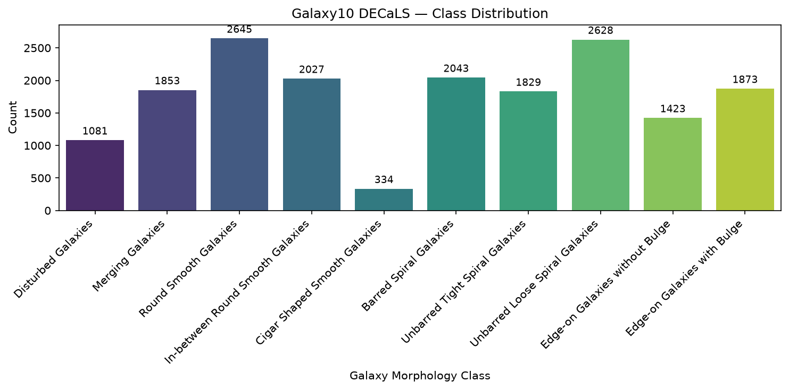
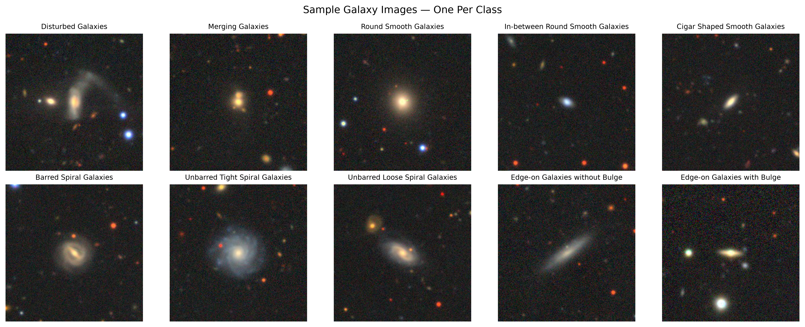
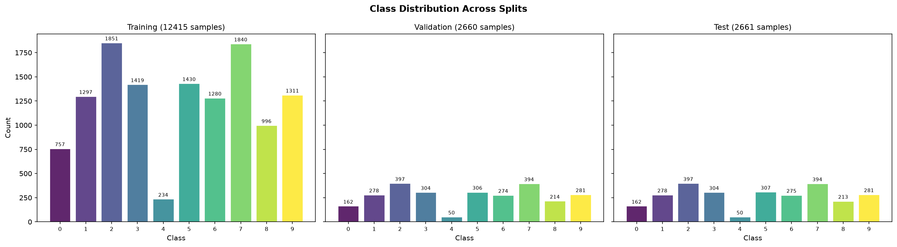
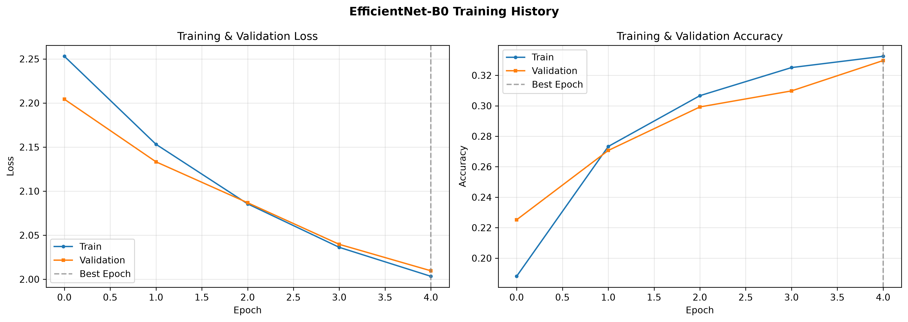
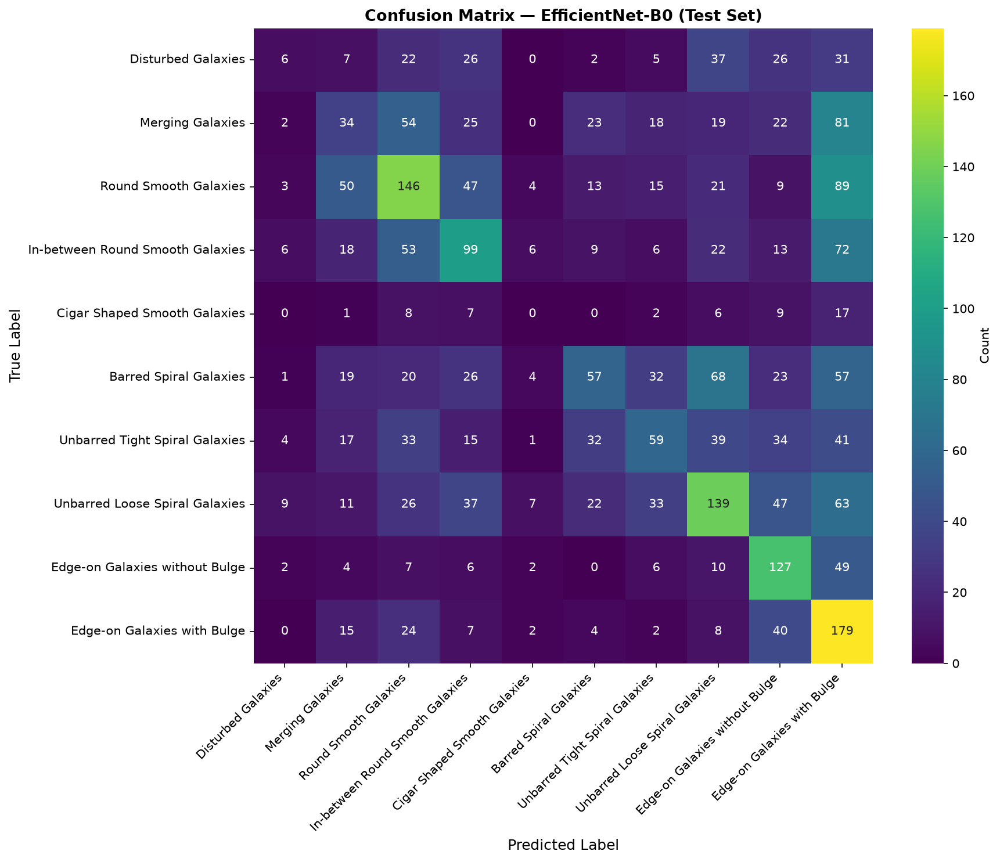
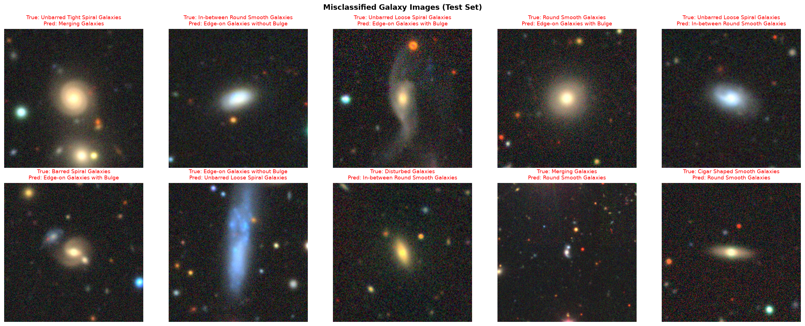
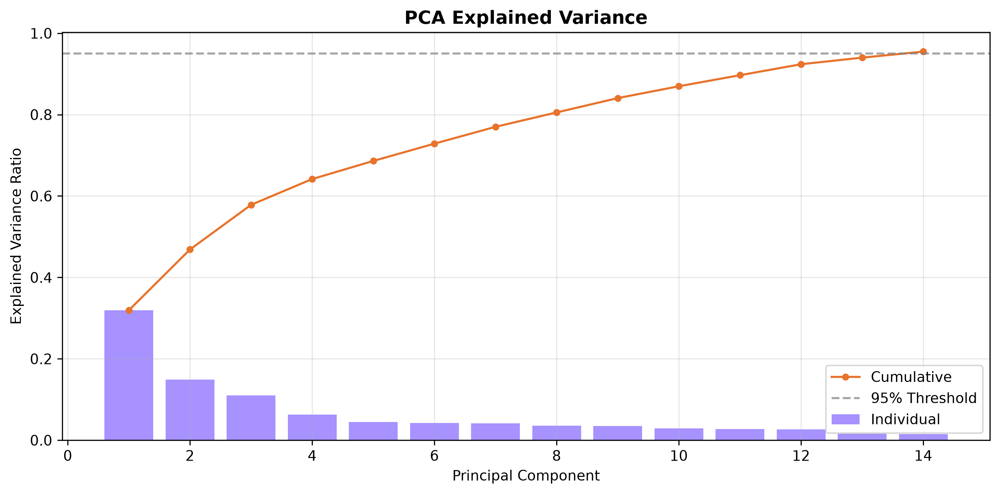
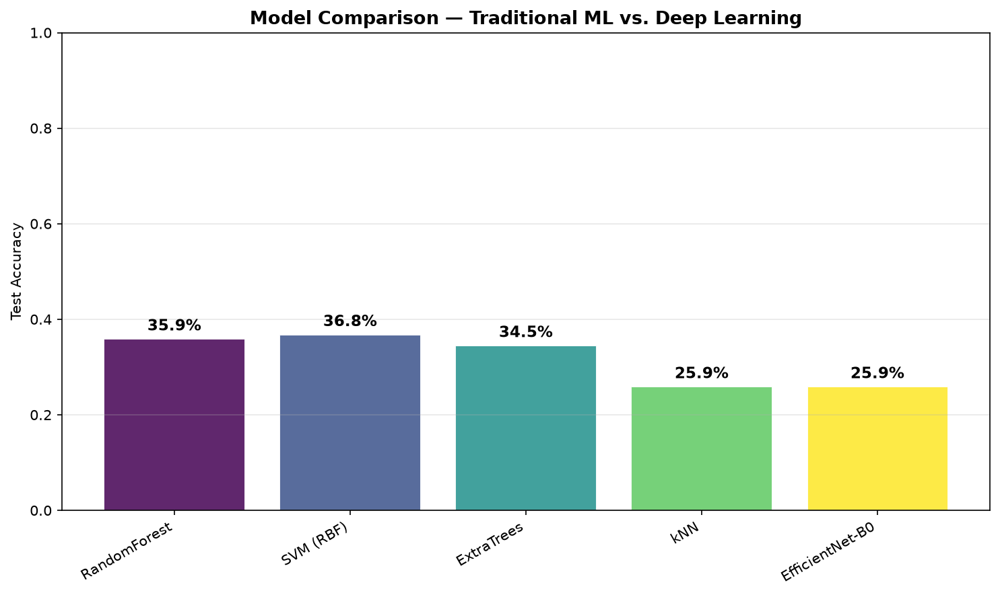

# Galaxy Morphology Classification Using Machine Learning

A comparative study evaluating deep learning and traditional machine learning approaches for classifying galaxy morphologies from the Galaxy10 DECaLS dataset (17,736 images, 10 morphological classes). The project benchmarks EfficientNet-B0 with ImageNet transfer learning against four classical classifiers (RandomForest, SVM, ExtraTrees, kNN) operating on 28 hand-crafted morphological features reduced to 14 PCA components, with class-weighted loss and stratified evaluation to address significant class imbalance.

---

## Key Findings

- **Traditional ML marginally outperformed a limited CNN baseline.** SVM (RBF) achieved 36.8% test accuracy versus EfficientNet-B0's 31.6%—though the CNN was constrained to 5 epochs on CPU with a frozen backbone, far below the 20+ epochs needed for convergence.

- **Hand-crafted features capture broad categories but miss fine-grained distinctions.** All traditional ML models achieved 0% F1 on the rarest class (Cigar Shaped Smooth, 234 training samples), exposing a fundamental limitation of scalar descriptors for underrepresented morphologies.

- **Overfitting plagues ensemble methods on low-dimensional features.** RandomForest and ExtraTrees both hit 99.8% training accuracy but dropped to ~35% on test, while SVM's RBF decision boundary generalized better from 14 PCA components (44.3% train, 36.8% test).

- **Feature engineering quality constrains the performance ceiling.** 28 hand-crafted features (Haralick textures, Hu moments, shape moments, color statistics, edge intensity) encode meaningful but incomplete morphological information—sufficient for separating mergers from smooth ellipticals, inadequate for barred vs. unbarred spirals.

- **CNNs are expected to dominate with adequate training.** Published transfer learning benchmarks on Galaxy10 DECaLS report 80%+ accuracy with 20+ epochs on GPU and backbone unfreezing, motivating the shift from hand-crafted features to learned spatial representations.

---

## Visual Results



*Figure 1: Class distribution across 10 morphological categories, showing significant imbalance—from 234 Cigar Shaped Smooth to 1,851 Round Smooth galaxies.*

<br>



*Figure 2: Representative galaxy image from each of the 10 morphological classes.*

<br>



*Figure 3: Class distribution preserved across train/validation/test splits via stratified sampling.*

<br>



*Figure 4: Training and validation loss/accuracy across 5 epochs for EfficientNet-B0 (CPU, frozen backbone).*

<br>



*Figure 5: Test set confusion matrix for EfficientNet-B0, revealing confusion between morphologically similar classes (e.g., barred vs. unbarred spirals).*

<br>



*Figure 6: Randomly sampled misclassified test images with true and predicted labels.*

<br>



*Figure 7: PCA explained variance—14 components retain 95.5% of total variance from 28 standardized features.*

<br>



*Figure 8: Test accuracy comparison across all traditional ML models and EfficientNet-B0.*

---

## Results at a Glance

| Metric | Best Model | Score |
|--------|------------|-------|
| **Best Traditional ML Accuracy** | SVM (RBF) | **36.8%** |
| **Best Deep Learning Accuracy** | EfficientNet-B0 (5 epochs, CPU) | **31.6%** |
| **Highest Train Accuracy (overfit)** | RandomForest / ExtraTrees | **99.8%** |
| **PCA Components (95% variance)** | StandardScaler + PCA | **14 of 28** |
| **Worst-performing Model** | kNN | **25.9%** |
| **Failed Class (all models)** | Cigar Shaped Smooth | **0% F1** |

*Bold values indicate the best-performing model for each metric.*

---

## Final Leaderboard

| Rank | Model | Approach | Test Accuracy | Macro F1 | Weighted F1 | Overfit Risk |
|------|-------|----------|-------------|----------|-------------|--------------|
| 1 | SVM (RBF) | Traditional ML | **36.8%** | 0.30 | 0.35 | Low |
| 2 | RandomForest | Traditional ML | 35.9% | 0.30 | 0.34 | Severe (99.8% train) |
| 3 | EfficientNet-B0 | Deep Learning | 31.6% | 0.27 | 0.30 | Low (frozen backbone) |
| 4 | ExtraTrees | Traditional ML | 34.5% | 0.29 | 0.33 | Severe (99.8% train) |
| 5 | kNN | Traditional ML | 25.9% | 0.23 | 0.26 | Moderate |

*Test accuracy computed on held-out test set (2,661 samples). EfficientNet-B0 trained for 5 epochs on CPU with frozen backbone—preliminary baseline, not fully converged.*

---

## Models Compared

| Model | Type | Library | Key Configuration |
|---|---|---|---|
| EfficientNet-B0 (ImageNet transfer learning) | Deep Learning | PyTorch | Frozen backbone, Adam (lr=1e-4), class-weighted CE |
| Random Forest | Ensemble | scikit-learn | 300 estimators |
| SVM (RBF kernel) | Classical | scikit-learn | C=3, gamma=scale |
| ExtraTrees | Ensemble | scikit-learn | 300 estimators |
| k-Nearest Neighbors | Classical | scikit-learn | k=5 |

---

## Dataset

**Citation:**

Galactic, M., Lam, C., & Leung, N. (2018). *Galaxy10 DECals Dataset*. astroNN. https://github.com/henrysky/astroNN

Walmsley, M. et al. (2022). *Galaxy Zoo DECaLS: Detailed Visual Morphology Measurements from Volunteers and Deep Learning*. MNRAS, 509(3), 3966–3988.

<br>

**Property Summary:**

| Property | Value |
|----------|-------|
| Total Images | 17,736 |
| Image Size | 256 × 256 RGB |
| Classes | 10 morphological categories |
| Source | DECaLS survey / Galaxy Zoo |
| Train Split | 12,415 (70%) |
| Validation Split | 2,660 (15%) |
| Test Split | 2,661 (15%) |
| Most Common Class | Round Smooth Galaxies (1,851 train) |
| Rarest Class | Cigar Shaped Smooth Galaxies (234 train) |

---

## Feature Engineering

| Feature Group | Description | Dimensions |
|---------------|-------------|------------|
| Haralick Textures (GLCM) | Contrast, dissimilarity, homogeneity, energy, correlation, ASM—averaged across 4 directions | 6 |
| Normalized Central Shape Moments | Spatial intensity distribution (nu20, nu11, nu02, nu30, nu21, nu12, nu03) | 7 |
| Hu Moments | Seven invariant shape moments (translation, rotation, scale invariant) | 7 |
| Color Statistics | Mean and standard deviation per RGB channel | 6 |
| Canny Edge Intensity | Mean and standard deviation of edge response | 2 |
| **Total** | | **28** |

*PCA reduced 28 standardized features to 14 components (95.5% variance retained).*

---

## Methodology

- **Data split:** Stratified 70/15/15 (train/validation/test), preserving class distribution across all subsets

- **Augmentation (DL):** Rotation (±180°), horizontal/vertical flips, brightness/contrast, random resized crop — justified by the lack of preferred orientation in galaxies; validation and test sets received normalization only

- **Normalization:** ImageNet mean/std applied via Albumentations for deep learning; StandardScaler (fit on train only) for traditional ML

- **Class imbalance handling:** Class-weighted cross-entropy loss with weights inversely proportional to training-set frequency (Cigar Shaped: 5.31, Round Smooth: 0.67)

- **Dimensionality reduction:** PCA preserving 95% variance → 14 components from 28 features

- **Optimizer:** Adam (lr=1e-4, weight_decay=1e-4) with ReduceLROnPlateau scheduler (factor=0.5, patience=2)

- **Early stopping:** Patience of 5 stagnant epochs on validation accuracy

- **Evaluation metrics:** Overall accuracy, per-class precision/recall/F1, confusion matrices, misclassified example inspection

---

## Tech Stack


---

## Conclusion

Galaxy morphology classification demands identification of subtle visual features—spiral arm winding, bar presence, bulge prominence, tidal distortion—that resist compression into fixed-length scalar descriptors. This study demonstrates that **hand-crafted features capture meaningful but incomplete morphological information**, achieving moderate accuracy on broad categories but failing entirely on rare and fine-grained classes.

The SVM's advantage over ensemble methods stems from its RBF kernel's resistance to overfitting on 14 PCA components. RandomForest and ExtraTrees memorized the training set (99.8% accuracy) but collapsed to ~35% on unseen data, illustrating the curse of dimensionality's inverse: too few informative features cause tree-based models to latch onto noise.

EfficientNet-B0's 31.6% accuracy in a 5-epoch CPU run is not representative of CNN potential. The steady improvement across epochs (18.8% → 33.3% validation accuracy) and the architecture's proven track record on Galaxy10 DECaLS (80%+ with full training) confirm that learned spatial representations ultimately surpass hand-crafted alternatives for this task.

The complete failure of all models on Cigar Shaped Smooth galaxies (0% F1) exposes the sharpest limitation: with only 234 training samples and features that collapse elongated ellipticals into statistically similar regions to round smooth galaxies, neither approach can distinguish this class. This motivates incorporating higher-resolution imaging, additional photometric features (surface brightness profiles, Sérsic indices), and data augmentation strategies tailored to rare morphologies.

For astronomy researchers: traditional ML offers a fast, interpretable baseline connected to physical galaxy properties, while CNNs provide the performance ceiling—but only when adequately trained. The gap between 28 scalar features and millions of learned spatial features is the gap between "good enough for broad surveys" and "precise enough for detailed morphological taxonomy."

---

## Future Work

- Train EfficientNet-B0 for 20+ epochs on GPU with backbone unfreezing for full convergence
- Implement focal loss as an alternative to class-weighted cross-entropy
- Compare additional architectures: EfficientNet-B4, ResNet-50, ConvNeXt
- Explore unsupervised clustering to discover novel morphological subgroups
- Incorporate photometric features (redshift, surface brightness, Sérsic index) alongside image data
- Evaluate cross-dataset transfer using Galaxy Zoo 2 as a secondary benchmark

---

### Reproducibility

- **Python version:** 3.13 (tested locally)

- **Platform:** Windows 11

- **Package manager:** pip (no Conda used)

- **Random seeds:** `SEED=42` across NumPy, Python `random`, and PyTorch

- **Data split:** Stratified 70/15/15 (train/validation/test), `random_state=42`

- **Dependencies:** See `requirements.txt` for exact package versions

- **Dataset:** 17,736 images, 10 classes, 256×256 RGB (Galaxy10 DECaLS via astroNN)

- **Features:** 28 hand-crafted (Haralick, Hu, shape moments, color, edges) → 14 PCA components

- **Figures:** Generated at 300 DPI for publication quality

---

## License

MIT License. See [`LICENSE`](LICENSE) file for details.

---

## Getting Started

```bash
# Clone the repository
git clone https://github.com/brianurban/galaxy-morphology-classification.git

# Install dependencies
pip install -r requirements.txt

# Run the notebook
jupyter notebook galaxy-morphology-classification.ipynb
